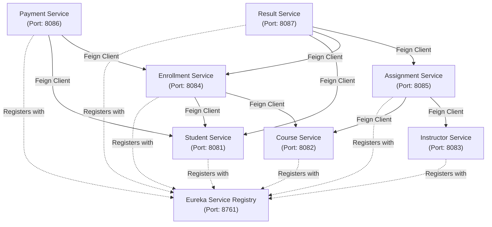

# 📚 Online Learning Management System (Microservices)

A scalable, distributed **Online Learning Management System** built with **Spring Boot**, **Spring Cloud Netflix Eureka**, **Spring Cloud OpenFeign**, **Spring Data JPA**, and **MySQL**.

---

## 📑 Table of Contents
- [Architecture Overview](#-architecture-overview)
- [Microservices & Port Configuration](#-microservices--port-configuration)
- [Inter-Service Communication](#-inter-service-communication)
- [Tech Stack](#-tech-stack)
- [Prerequisites](#-prerequisites)
- [Database Setup](#-database-setup)
- [Running the Services](#-running-the-services)
- [API Documentation](#-api-documentation)
- [License](#-license)

---

## 🏛 Architecture Overview

The system is composed of an independent **Eureka Discovery Server** and seven domain microservices. Dependent services communicate seamlessly with core services using declarative REST clients powered by **Spring Cloud OpenFeign**.



---

## ⚙ Microservices & Port Configuration

| Service Name | Application Name | Port | Description |
| :--- | :--- | :--- | :--- |
| **Eureka Server** | `eurekaserver` | `8761` | Service discovery and registration hub |
| **Student Service** | `student-service` | `8081` | Manages student profiles and contacts |
| **Course Service** | `course-service` | `8082` | Manages courses, duration, and fees |
| **Instructor Service** | `instructor-service` | `8083` | Manages instructor profiles and specializations |
| **Enrollment Service**| `Enrollment-service`| `8084` | Manages course enrollments for students |
| **Assignment Service**| `assignmentservice` | `8085` | Manages assignments tied to courses and instructors |
| **Payment Service** | `paymentservice` | `8086` | Manages student fee payments and transaction status |
| **Result Service** | `resultservice` | `8087` | Manages student grades and assessment marks |

---

## 🔗 Inter-Service Communication

Services use **OpenFeign** to validate existence and query details across service boundaries:

| Calling Service | Feign Client | Target Service | Purpose |
| :--- | :--- | :--- | :--- |
| `Enrollment-service` | `StudentClient` | `student-service` | Validates student before enrollment |
| `Enrollment-service` | `CourseClient` | `course-service` | Validates course before enrollment |
| `assignmentservice` | `CourseClient` | `course-service` | Links assignment to course |
| `assignmentservice` | `InstructorClient` | `instructor-service` | Assigns instructor to assignment |
| `paymentservice` | `StudentClient` | `student-service` | Validates student for payment |
| `paymentservice` | `EnrollementClient`| `Enrollment-service` | Verifies enrollment reference |
| `resultservice` | `StudentClient` | `student-service` | Verifies student record |
| `resultservice` | `EnrollementClient`| `Enrollment-service` | Verifies course enrollment |
| `resultservice` | `AssignmentClient` | `assignmentservice` | Links assessment results to assignment |

---

## 💻 Tech Stack

- **Language:** Java 21
- **Framework:** Spring Boot, Spring Cloud (Eureka Client / Server, OpenFeign)
- **Data Access:** Spring Data JPA (Hibernate)
- **Database:** MySQL
- **Build Tool:** Maven (Wrapper included)

---

## 📋 Prerequisites

Before running the application, make sure you have:
1. **Java JDK 21** or later installed.
2. **MySQL Server** running locally on default port `3306`.
3. **Maven** (optional, you can use the bundled `./mvnw` script).

---

## 🗄 Database Setup

Create the MySQL database specified in `application.properties`:

```sql
CREATE DATABASE IF NOT EXISTS mahak;
```

> **Note:** By default, each microservice connects to `jdbc:mysql:///mahak`. Update username and password in `application.properties` of each service if your local MySQL credentials differ from `root` / `raman`.

---

## 🚀 Running the Services

To ensure proper discovery and registration, start the services in the following order:

### 1. Start Eureka Server (First)
```bash
cd eurekaserver
./mvnw spring-boot:run
```
*Verify Eureka dashboard at:* [http://localhost:8761](http://localhost:8761)

### 2. Start Core Domain Services
Open separate terminal tabs for each service:
```bash
# Student Service (Port 8081)
cd student-service && ./mvnw spring-boot:run

# Course Service (Port 8082)
cd course-service && ./mvnw spring-boot:run

# Instructor Service (Port 8083)
cd instructor-service && ./mvnw spring-boot:run
```

### 3. Start Dependent Services
```bash
# Enrollment Service (Port 8084)
cd Enrollment-service && ./mvnw spring-boot:run

# Assignment Service (Port 8085)
cd assignmentservice && ./mvnw spring-boot:run

# Payment Service (Port 8086)
cd paymentservice && ./mvnw spring-boot:run

# Result Service (Port 8087)
cd resultservice && ./mvnw spring-boot:run
```

---

## 📖 API Documentation

### 1. Student Service (`http://localhost:8081/students`)
| Method | Endpoint | Description |
| :--- | :--- | :--- |
| `GET` | `/students` | Get all students |
| `GET` | `/students/{id}` | Get student by ID |
| `POST` | `/students` | Create new student |
| `PUT` | `/students/{id}` | Update student details |
| `DELETE` | `/students/{id}` | Delete student |

**Sample Request Body (POST/PUT):**
```json
{
  "name": "John Doe",
  "email": "john.doe@example.com",
  "mobile": 987654321
}
```

---

### 2. Course Service (`http://localhost:8082/courses`)
| Method | Endpoint | Description |
| :--- | :--- | :--- |
| `GET` | `/courses` | Get all courses |
| `GET` | `/courses/{id}` | Get course by ID |
| `POST` | `/courses` | Create new course |
| `PUT` | `/courses/{id}` | Update course details |
| `DELETE` | `/courses/{id}` | Delete course |

**Sample Request Body (POST/PUT):**
```json
{
  "courseName": "Full Stack Java & Microservices",
  "duration": 6,
  "fee": 15000
}
```

---

### 3. Instructor Service (`http://localhost:8083/instructor`)
| Method | Endpoint | Description |
| :--- | :--- | :--- |
| `GET` | `/instructor` | Get all instructors |
| `GET` | `/instructor/{id}`| Get instructor by ID |
| `POST` | `/instructor` | Create new instructor |
| `PUT` | `/instructor/{id}`| Update instructor details |
| `DELETE`| `/instructor/{id}`| Delete instructor |

**Sample Request Body (POST/PUT):**
```json
{
  "name": "Dr. Alan Turing",
  "email": "alan.turing@example.com",
  "specialization": "Computer Science & Distributed Systems"
}
```

---

### 4. Enrollment Service (`http://localhost:8084/enrollements`)
| Method | Endpoint | Description |
| :--- | :--- | :--- |
| `GET` | `/enrollements` | Get all enrollments |
| `GET` | `/enrollements/{id}` | Get enrollment by ID |
| `POST` | `/enrollements?studentid={id}&courseid={id}` | Enroll a student in a course |
| `PUT` | `/enrollements/{id}` | Update enrollment status |
| `DELETE` | `/enrollements/{id}` | Delete enrollment |

**Sample Request Body (POST):**
```json
{
  "status": "ACTIVE"
}
```

---

### 5. Assignment Service (`http://localhost:8085/assignments`)
| Method | Endpoint | Description |
| :--- | :--- | :--- |
| `GET` | `/assignments` | Get all assignments |
| `GET` | `/assignments/{id}` | Get assignment by ID |
| `POST` | `/assignments?courseid={id}&instructorid={id}` | Create an assignment |
| `PUT` | `/assignments/{id}` | Update assignment details |
| `DELETE` | `/assignments/{id}` | Delete assignment |

**Sample Request Body (POST):**
```json
{
  "title": "Spring Cloud Microservices Assignment",
  "description": "Implement service discovery with Eureka and Feign Client",
  "duedate": 20261015
}
```

---

### 6. Payment Service (`http://localhost:8086/payments`)
| Method | Endpoint | Description |
| :--- | :--- | :--- |
| `GET` | `/payments` | Get all payment records |
| `GET` | `/payments/{id}` | Get payment by ID |
| `POST` | `/payments?enrollementid={id}&studentid={id}` | Process student course payment |
| `PUT` | `/payments/{id}` | Update payment status / amount |
| `DELETE` | `/payments/{id}` | Delete payment record |

**Sample Request Body (POST):**
```json
{
  "amount": 15000,
  "status": "COMPLETED"
}
```

---

### 7. Result Service (`http://localhost:8087/results`)
| Method | Endpoint | Description |
| :--- | :--- | :--- |
| `GET` | `/results` | Get all result records |
| `GET` | `/results/{id}` | Get result by ID |
| `POST` | `/results?enrollementid={id}&studentid={id}&assignmentid={id}` | Record student assignment result |
| `PUT` | `/results/{id}` | Update marks and grade |
| `DELETE` | `/results/{id}` | Delete result record |

**Sample Request Body (POST):**
```json
{
  "marks": 95,
  "grade": "A+"
}
```

---

## 👤 Author

- **Raman Chourasiya** - [@Raman-1166](https://github.com/Raman-1166)
